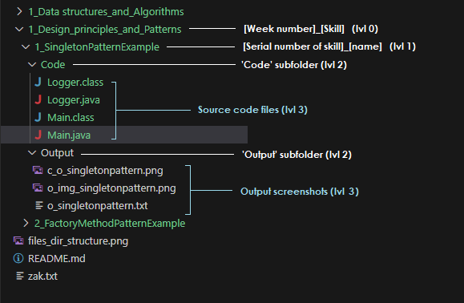

# Digital-Nurture-4.0-JavaFSE
---------------------------
The content and solutions of the exercises are organized as in the below example format:

This structure follows option 2 from the provided Guidelines for Github repositories.